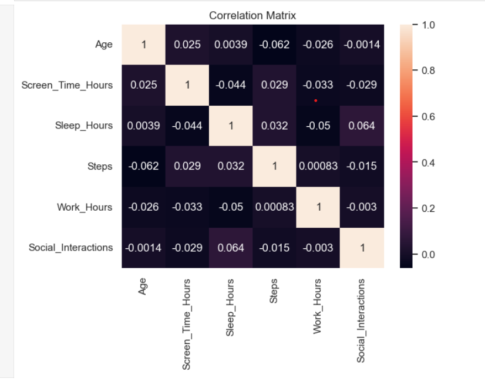
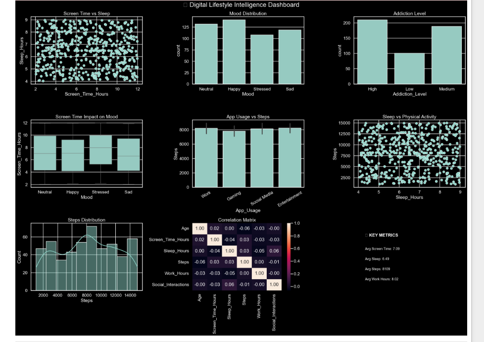

# 📊 Digital Behavior Analysis & User Lifestyle Insights

## 🧠 Project Overview
This project analyzes user digital behavior data to understand the relationship between **screen time, sleep patterns, mood, and physical activity**.

Using Python, the project performs **data cleaning, transformation, exploratory data analysis (EDA), and visualization** to generate meaningful insights.

---

## ⚙️ Tech Stack
- Python 🐍
- Pandas
- NumPy
- Matplotlib
- Seaborn

---

## 📂 Dataset
- Raw dataset: `raw_behavior_data.csv`
- Contains user data such as:
  - Age
  - Gender
  - Screen Time
  - Sleep Hours
  - Steps Count
  - Mood
  - App Usage

---

## 🔄 Project Workflow

### 1️⃣ Data Cleaning
- Handled missing values
- Removed duplicates
- Fixed data types
- Standardized categorical data

### 2️⃣ Feature Engineering
- Created:
  - Addiction Level (Low / Medium / High)
  - Sleep Category (Poor / Average / Good)

### 3️⃣ Exploratory Data Analysis (EDA)
- Statistical summaries
- Outlier detection
- Correlation analysis

### 4️⃣ Data Visualization
- Scatter Plot → Screen Time vs Sleep
- Bar Chart → App Usage vs Steps
- Count Plot → Mood Distribution
- Box Plot → Screen Time vs Mood
- Heatmap → Correlation Matrix

### 5️⃣ Dashboard
- Designed multi-visual layout (3x3 grid)
- Applied dark theme for better visualization

### 📊 Sample Visualizations




---

## 📈 Key Insights
- Higher screen time leads to lower sleep duration
- High screen usage indicates higher addiction levels
- Mood is influenced by screen time patterns
- Increased app usage reduces physical activity
- Strong correlations identified between variables

---

## 🎯 Project Outcome
- Converted raw data into actionable insights
- Built a clean and structured dataset
- Created visualizations for decision-making

---

## 🚀 How to Run the Project

```bash
# Install required libraries
pip install pandas numpy matplotlib seaborn

# Run the notebook
jupyter notebook project.ipynb
